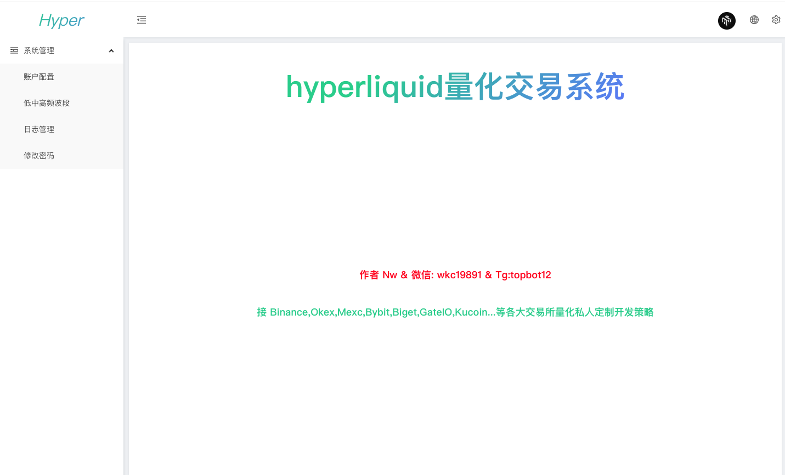

# Node.js & Typescript OKX (OKEX) API & WebSocket SDK

## Installation

```bash
npm install okx-api-nw
```


## Documentation

Most methods accept JS objects. These can be populated using parameters specified by okx's API documentation, or check the type definition in the rest-client class methods.

- [RestClient](src/rest-client.ts)
- [OKX API Documentation](https://www.okx.com/docs-v5/en/#rest-api)
- [REST Endpoint Function List](./docs/endpointFunctionList.md)
- [TSDoc Documentation (generated using typedoc via npm module)](https://github.com/little-fish-foundation/okx-api-nw)

## Structure

This project uses typescript. Resources are stored in 3 key structures:

- [src](./src) - the whole connector written in typescript
- [lib](./lib) - the javascript version of the project (compiled from typescript). This should not be edited directly, as it will be overwritten with each release. This is also the version published to npm.
- [dist](./dist) - the packed bundle of the project for use in browser environments (manual, using webpack).
- [examples](./examples) - some implementation examples & demonstrations. Contributions are welcome!

---

## REST Client

### Requests & Responses

- If your IDE doesn't have IntelliSense, check the [rest-client.ts](./src/rest-client.ts) for a list of methods, params & return types.
- Requests follow the same ordering and format as the categories in the [API docs](https://www.okx.com/docs-v5/en/#rest-api).
- Responses are parsed automatically for less nesting. Error responses are thrown in full:
  - If the response looks successful (HTTP 200 and "code" in the response body === "0"), only the `data` property is directly (without the `code`, `data` & `msg` properties).
  - If the response looks like an error (HTTP error OR the "code" property in the response does not equal "0"), the full response is thrown (including `code` and `msg` properties). See the interface for [APIResponse<T>](./src/types/rest/shared.ts).

## Websocket Client

This connector includes a high-performance node.js & typescript websocket client for the OKX public & private websockets.

- If your IDE doesn't have IntelliSense, check the [websocket-client.ts](./src/websocket-client.ts) for a list of methods, params & return types.
- When subscribing to channels, only the "args" should be passed as an object or array when calling the websocket client subcribe() function: [API docs](https://www.okx.com/docs-v5/en/#websocket-api-subscribe).
- TypeScript recommended (but it is not required) for a richer experience:
  
- The ws client will automatically open connections as needed when subscribing to a channel.
- If the connection is lost for any reason, the ws client will detect this (via the connection heartbeats). It will then:
  - Automatically teardown the dead connection.
  - Automatically respawn a fresh connection.
  - Automatically reauthenticate, if using private channels.
  - Automatically resubscribe to previously subscribed topics.
  - Resume producing events as before, without extra handling needed in your logic.
- The ws client will automatically authenticate if accounts are provided and a private channel is subscribed to.
- Up to 100 accounts are supported on the private connection, as per the [API docs](https://www.okx.com/docs-v5/en/#websocket-api-login). Authentication is automatic if accounts are provided.
- For examples in using the websocket client, check the examples in the repo:
  - Private channels (account data): [examples/ws-private.ts](./examples/ws-private.ts)
  - Public chanels (market data): [examples/ws-public.ts](./examples/ws-public.ts)
  - These examples are written in TypeScript, so can be executed with ts-node for easy testing:
    `ts-node examples/ws-private.ts`
  - Or convert them to javascript:
    - Change the `import { ... } from 'okx-api-nw'` to `const { ... } = require('okx-api-nw');`
    - Rename the file to `ws-private.js`
    - And execute with node: `node examples/ws-private.js`

### Public Events

See [examples/ws-public.ts](./examples/ws-public.ts) for a full example:


### Private Events

See [examples/ws-private.ts](./examples/ws-private.ts) for a full example:


## Browser/Frontend Usage

### Import

This is the "modern" way, allowing the package to be directly imported into frontend projects with full typescript support.

1. Install these dependencies
   ```sh
   npm install crypto-browserify stream-browserify
   ```
2. Add this to your `tsconfig.json`
   ```json
   {
     "compilerOptions": {
       "paths": {
         "crypto": [
           "./node_modules/crypto-browserify"
         ],
         "stream": [
           "./node_modules/stream-browserify"
         ]
   }
   ```
3. Declare this in the global context of your application (ex: in polyfills for angular)
   ```js
   (window as any).global = window;
   ```

### Webpack

This is the "old" way of using this package on webpages. This will build a minified js bundle that can be pulled in using a script tag on a website.

Build a bundle using webpack:

- `npm install`
- `npm build`
- `npm pack`

The bundle can be found in `dist/`. Altough usage should be largely consistent, smaller differences will exist. Documentation is still TODO.

---

npm login --registry=https://registry.npmjs.org/

npm publish --registry=https://registry.npmjs.org/